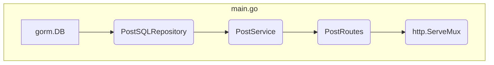

# 🌊 high-tide
Stateless SYN Flood detection using Count-Min Sketch. Tracks net connection imbalance with constant memory efficiency

Table of Contents
---
<!-- TOC -->
* [About](#about)
* [Building and Running](#building-and-running)
* [Directory Structure](#directory-structure)
* [API Endpoints](#api-endpoints)
* [Dependency Injection](#dependency-injection)
* [CMS Logic](#cms-logic)
* [Comparing `cms`, `map` and `none` mode](#comparing-cms-map-and-none-mode)
<!-- TOC -->

---
## About

The `high-tide-server` project presents a crude implementation of the usage of CountMinSketch to protect a GoLang based server against HTTP flooding attacks.

*An HTTP flood attack is a type of cyberattack where a large number of fake web requests are sent to a website to overwhelm it, making it slow or completely unavailable.*

> *This project was built alongside a series of blogs that discuss Probabilistic Data Structures and their usage in real world scenarios.*
>
> https://eventuallyconsistentwrites.substack.com/p/probabilistic-data-structures

Think of a website like a small coffee shop.
- Normally, customers walk in, place an order, and get served.
- Now imagine thousands of people suddenly rush in at the same time.
- Even if each person only orders a small coffee, the shop can’t handle that many orders at once.
- Real customers can’t get served.
That’s basically what an HTTP flood attack does — but online.

### Why Count-Min Sketch Makes Sense for HTTP Flood Defense

HTTP flood attacks generate:
- Massive numbers of requests
- Many repeated keys (IP addresses, user agents, URLs, session IDs, etc.)
- High-speed traffic that must be analyzed in real time

A normal hash map can be:
- Too memory-heavy
- Too slow under extreme load

Count-Min Sketch solves this by:
- Using fixed, small memory
- Giving approximate counts
- Supporting very fast updates (O(1))

That’s perfect for detecting:
- “Which IP is sending too many requests?”
- “Which endpoint is being hit abnormally often?”

---

## Building and Running

### Building the Project Locally
This process is for building `high-tide-server` locally.
#### Build
```bash
go mod init github.com/eventuallyconsistentwrites/high-tide-server
go mod tidy
```
```bash
go build -o hts-main ./cmd/api/main.go
```
#### Install Dependencies
```bash
go get github.com/mattn/go-sqlite3
go mod tidy
```
#### Running the Project
```bash
go run ./cmd/api/main.go
# Or in case of pre-built binary
./hts-main
```
#### Testing Count-min Sketch
```bash
go test -v ./countmin
```

### Docker Build
[This README](https://github.com/eventuallyconsistentwrites/high-tide/blob/main/loadtester/README.md) gives the process for Docker build of `high-tide-server` and `loadtester`

---

## Directory Structure

### `api`
Contains server contract information.

### `cmd`
`api/main.go` contains application entry point.

### `countmin`
Contains data structure logic of Count-Min Sketch.
- `baseCounter.go`: Defines the `BaseCounter` interface that will be implemented by any class which need to be used as a counter by the rate limiter.
- `cms.go`: Defines the `CountMinSketch` class which implements the `BaseCounter` interface.
- `cms_test.go`: Defines a simple test case for the `CountMinSketch` class.
- `mapCounter.go`: Defines the `MapCounter` which is a map based counter that can be used as an alternative to the CMS.

### `examples`
Contains demo go script to use `CountMinSketch` data structure.

### `internal`
Contains code that is not intended to be used outside of this project.

#### `domain`
Contains definitions for data structures that will be used to structure the incoming request bodies as well as define sqlite tables.

#### `middleware`
Contains `ratelimtier.go` which defines the rate limiting middleware which will be invoked for each request. This rate limiter can use the CMS underneath for protecting the server against HTTP flooding attacks.

#### `repository`
Related to ORM system that is used to make the sqlite queries.

#### `routes`
Defines APIs for performing CRUD operations on the `Post` object.

#### `server`
Contains business logic that makes use of repositories. The results are returned to the APIs that queried the server.

#### `Dockerfile`
The `Dockerfile` is used to containerise the `high-tide-server`.

---

## API Endpoints

Check the [openapi specs](high-tide-server/api/openapi.json) to know more about the endpoints.
<table>
  <thead>
    <tr>
      <th>URL</th>
      <th>Method</th>
      <th>Description</th>
      <th>Request Body</th>
      <th>Responses</th>
    </tr>
  </thead>
  <tbody>
    <tr>
      <td rowspan="5"><code>/posts</code></td>
      <td rowspan="3"><code>POST</code></td>
      <td rowspan="3">Creates a new post in the system.</td>
      <td rowspan="3">A JSON object representing the post to be created.</td>
      <td><code>201 Created</code>: Post successfully created. Returns the created post object.</td>
    </tr>
    <tr>
      <td><code>400 Bad Request</code>: Invalid request body.</td>
    </tr>
    <tr>
      <td><code>500 Internal Server Error</code>: Failed to create post due to a server-side error.</td>
    </tr>
    <tr>
      <td rowspan="2"><code>GET</code></td>
      <td rowspan="2">Retrieves a list of all available posts.</td>
      <td rowspan="2"></td>
      <td><code>200 OK</code>: Returns a JSON array of all posts.</td>
    </tr>
    <tr>
      <td><code>500 Internal Server Error</code>: Failed to fetch posts due to a server-side error.</td>
    </tr>
    <tr>
      <td rowspan="8"><code>/post?id={id}</code></td>
      <td rowspan="4"><code>GET</code></td>
      <td rowspan="4">Retrieves a single post by its unique ID.</td>
      <td rowspan="4"></td>
      <td><code>200 OK</code>: Returns the post object matching the provided ID.</td>
    </tr>
    <tr>
      <td><code>400 Bad Request</code>: Missing ID parameter.</td>
    </tr>
    <tr>
      <td><code>404 Not Found</code>: Post with the given ID does not exist.</td>
    </tr>
    <tr>
      <td><code>500 Internal Server Error</code>: Failed to retrieve post due to a server-side error.</td>
    </tr>
    <tr>
      <td rowspan="4"><code>DELETE</code></td>
      <td rowspan="4">Deletes a post by its unique ID.</td>
      <td rowspan="4"></td>
      <td><code>200 OK</code>: Post successfully deleted. Returns the deleted post object.</td>
    </tr>
    <tr>
      <td><code>400 Bad Request</code>: Missing ID parameter.</td>
    </tr>
    <tr>
      <td><code>404 Not Found</code>: Post with the given ID does not exist.</td>
    </tr>
    <tr>
      <td><code>500 Internal Server Error</code>: Failed to delete post due to a server-side error.</td>
    </tr>
  </tbody>
</table>

---

## Dependency Injection

The High-Tide server utilizes a dependency injection pattern to manage its components, promoting modularity, testability, and maintainability. The `main.go` file orchestrates the creation and wiring of these dependencies.

### Dependency Injection Flow



Here's a breakdown of the dependency injection flow:

1.  **Database Connection:**
    -   A connection to the SQLite database (`high_tide.db`) is established using `gorm.Open(sqlite.Open("high_tide.db"), &gorm.Config{})`.
    -   The database schema is automatically migrated to match the `domain.Post` struct using `db.AutoMigrate(&domain.Post{})`.

2.  **Repository Layer:**
    -   An instance of `PostSQLRepository` is created using `repository.NewPostSQLRepository(db)`.
    -   The `db` (GORM database client) is injected into the `PostSQLRepository`, allowing the repository to interact with the database.

3.  **Service Layer:**
    -   An instance of `PostService` is created using `service.NewPostService(postRepo)`.
    -   The `postRepo` (PostSQLRepository) is injected into the `PostService`. The service layer encapsulates business logic and uses the repository to perform data operations.

4.  **Routes/Handler Layer:**
    -   An instance of `PostRoutes` (which acts as the HTTP handler for post-related requests) is created using `routes.NewPostRoutes(postSvc)`.
    -   The `postSvc` (PostService) is injected into the `PostRoutes`. This allows the handlers to call service methods to execute business logic.

5.  **HTTP Server Setup:**
    -   An `http.ServeMux` is created to act as the router.
    -   The `RegisterRoutes` method of `postHandler` is called, passing the `mux`. This registers all the defined HTTP endpoints (`/posts`, `/post`) with their corresponding handler functions (`CreatePost`, `GetAllPosts`, `GetPost`, `DeletePost`).

This structured approach ensures that each layer of the application is responsible for a specific concern and can be easily swapped or tested independently.

---

## CMS Logic

The Count-min Sketch is implemented in [`cms.go`](https://github.com/eventuallyconsistentwrites/high-tide/blob/main/high-tide-server/countmin/cms.go)

### The CountMinSketch Implementation

#### Struct Definition
The Count-min Sketch is depicted by the `CountMinSketch` struct.
```golang

type CountMinSketch struct {
	NumberOfHashFunctions int
	certainty             float64
	Width                 uint32
	errorMargin           float64
	cmsTable              [][]int
	mu                    sync.RWMutex
}
// NumberOfHashFunctions and Width are public attributes of the struct while certainty, errorMargin, cmsTable and mu are private attributes.
```

#### Constructor
It's constructor takes certainty and error margin as inputs to evaluate the correct size of the count min sketch using the following mathematical formulae.
$$w = \lceil \frac{e}{\epsilon} \rceil$$
- $w$ = width
- $e$ = Euler's Number
- $\epsilon$ = Error Margin

Code: `width := math.Ceil(math.E / errorMargin)`

$$d = \lceil \ln(\frac{1}{\delta}) \rceil$$
- $d$ = depth (Number of hash functions)
- $\delta$ = certainty

Code: `numberOfHashFunctions := math.Ceil(math.Log(1 / certainty))`

#### Implementing `BaseCounter`

It implements the `BaseCounter` interface by implementing the `String()`, `Update()`, `PointQuery()` and `Reset()` methods.
1. The `String()` method is used to construct a string that represents the CMS which can be used to log the CMS.
2. The `Update()` method is used to increment the frequency of the input string in the CMS.
```golang
func (cms *CountMinSketch) Update(value string) {
    cms.mu.Lock()
    defer cms.mu.Unlock() //Unlock on function end
    var data []byte = []byte(value)
    for i := 0; i < cms.NumberOfHashFunctions; i++ { //For each hash function
        var seed uint32 = uint32(i)
        hashValue := murmur3.SeedSum32(seed, data) //The input value's hashValue representation is calculated
        cms.cmsTable[i][hashValue%cms.Width]++ //The frequency corresponding to the chosen hash function and hashValue is incremented
    }
}
```

3. The `PointQuery()` function is used to fetch the count of the input value from the CMS.
```golang
func (cms *CountMinSketch) PointQuery(value string) int {
	cms.mu.RLock()
	defer cms.mu.RUnlock() //Unlock on function end
	var data []byte = []byte(value)
	minFreq := math.MaxInt
	for i := 0; i < cms.NumberOfHashFunctions; i++ { //For each hash function
		var seed uint32 = uint32(i)
		hashValue := murmur3.SeedSum32(seed, data)
		freq := cms.cmsTable[i][hashValue%cms.Width] //Find the frequency corresponding to the current hash function
		if freq < minFreq {
			minFreq = freq //See if the evaluated frequency is the least out of all the frequencies for the input value
		}
	}
	return minFreq
}
```

4. The `Reset()` function is used to set all frequencies to 0 for the CMS. This is used to clear the CMS periodically to avoid stale values occupying the CMS.

#### How the CMS is Invoked

1. An instance of the CMS is created inside [`main.go`](https://github.com/eventuallyconsistentwrites/high-tide/blob/main/high-tide-server/cmd/api/main.go) and then passed to the rate limiter middleware.
```golang
// First the CMS is initialised based on the certainty and error margin input
if rlMode == "cms" {
    cmsCertainty := 0.01 // Default value in seconds
    if cmsCertaintyStr != "" {
        var err error
        cmsCertainty, err = strconv.ParseFloat(cmsCertaintyStr, 64)
        if err != nil {
            logger.Warn("Invalid RESET_INTERVAL, using default value", "value", resetIntervalStr, "defaultSeconds", resetInterval)
            cmsCertainty = 30 // Fallback to default if parsing fails
        }
    }
    cmsErrorMargin := 0.001 // Default value in seconds
    if cmsErrorMarginStr != "" {
        var err error
        cmsErrorMargin, err = strconv.ParseFloat(cmsErrorMarginStr, 64)
        if err != nil {
            logger.Warn("Invalid RESET_INTERVAL, using default value", "value", resetIntervalStr, "defaultSeconds", resetInterval)
            cmsErrorMargin = 0.001 // Fallback to default if parsing fails
        }
    }
    // Initialize Count-Min Sketch and Rate Limiter middleware.
    counter = countmin.NewCountMinSketch(cmsCertainty, cmsErrorMargin)
    logger.Info("Initialised CMS",
        "NumberOfHashFunctions", counter.(*countmin.CountMinSketch).NumberOfHashFunctions,
        "Width", counter.(*countmin.CountMinSketch).Width,
    )
}
```

```golang
// Provide cms as input to rate limiter
rateLimiter := middleware.NewRateLimiter(&counter, threshold, logger)
handler = rateLimiter.Limit(handler) // The rateLimiter is used as a middleware in the http server
```

2. Since the rate limiter is a middleware, it will play a part in every request to the server. The `Limit` method of the `RateLimiter` class (in [`ratelimiter.go`](https://github.com/eventuallyconsistentwrites/high-tide/blob/main/high-tide-server/internal/middleware/ratelimiter.go)) will be called for every request.

```golang
func (rl *RateLimiter) Limit(next http.Handler) http.Handler {
	return http.HandlerFunc(func(w http.ResponseWriter, r *http.Request) {
		// In a production environment, you'd often be behind a reverse proxy.
		// The X-Forwarded-For header is the standard way to identify the originating IP.
		ip := r.Header.Get("X-Forwarded-For")
		if ip == "" {
			// If the header is not present, fall back to the remote address.
			var err error
			ip, _, err = net.SplitHostPort(r.RemoteAddr)
			if err != nil {
				ip = r.RemoteAddr // Fallback for addresses without a port
			}
		}

		// Create a logger with context about this specific request
		requestLogger := rl.logger.With("ip", ip, "remote_addr", r.RemoteAddr)
		requestLogger.Info("checking rate limit")

		rl.counter.Update(ip) // rl.counter refers to the counter instantiated and set in main
		count := rl.counter.PointQuery(ip)

		// rl.counter.DisplayCMS() // This can be very verbose, consider removing from hot path
		if count > rl.threshold {
			requestLogger.Warn("rate limit exceeded", "count", count, "threshold", rl.threshold)
			http.Error(w, "Too Many Requests", http.StatusTooManyRequests)
			return
		}

		next.ServeHTTP(w, r)
	})
}
```

3. The `rl.counter.Update()` and `rl.counter.PointQuery()` calls are based on the [`BaseCounter`](https://github.com/eventuallyconsistentwrites/high-tide/blob/main/high-tide-server/countmin/baseCounter.go) interface definition. 
4. This interface is implemented by [`MapCounter`](https://github.com/eventuallyconsistentwrites/high-tide/blob/main/high-tide-server/countmin/mapCounter.go) and [`CountMinSketch`](https://github.com/eventuallyconsistentwrites/high-tide/blob/main/high-tide-server/countmin/cms.go) classes.
5. Based on the `RL_MODE` environment variable value the counter value can either be of type `MapCounter` or `CountMinSketch` providing different qualities of protection.

---

## Comparing `cms`, `map` and `none` mode
The current implementation allows the rate limiter to either use Count-min sketch or a map to count frequencies and also allows you to disable rate limiting.
The server's performance was compared under all three modes.

By parsing the k6-worker side logs as well as the high-tide-server side logs we can visualise how the server performs in all three modes.

### Graph A: The Client’s Perspective (K6 Logs)

It shows how many requests the attackers (load testers) could successfully push and how long they waited for a response.

- Throughput (RPS): The "CMS Mode" bars were significantly taller than "Map Mode." "None Mode" was non-existent (failed).
- Latency: The "CMS Mode" had much lower bars (faster response) compared to the "Map Mode," which showed high latency and variance (jitter).

Key Takeaway: The clients will feel a much smoother, faster experience when the server is protected by the Count-Min Sketch.

### Graph B: The Server’s Perspective (Backend Logs)

It shows the actual processing rate of the internal engine over time.

- CMS Line: A higher curve showing server was able to process more requests.
- Map Line: A lower, jagged line. The server was "struggling" and stuttering.
- None Line: A flatline at zero. The server was "dead."

Key Takeaway: The server's internal machinery ran more efficiently when using probabilistic data structures (CMS).

### Conclusion: The "Why" Behind the Performance
The data proves that Count-Min Sketch (CMS) is the superior architecture for high-concurrency rate limiting in this specific scenario.

- Lock Contention is the Killer: The CMS implementation is efficient enough to clear the lock queue faster, whereas the Map implementation keeps threads waiting slightly longer, leading to a traffic jam. This is why a lower throughput and higher latency is seen.
- Probabilistic Speed: CMS Mode allows for "good enough" accuracy without the heavy locking penalties. It trades a tiny percentage of accuracy (which doesn't matter much for rate limiting) for massive gains in speed and parallelism.
- Survival of the Fittest: None Mode proves that some protection is always better than none. Without a gatekeeper, the application logic was overwhelmed instantly, causing a total system failure (Crash/OOM).

Final Verdict: The Count-Min Sketch implementation provided a increase in throughput and a reduction in latency compared to the standard Hash Map, while also preventing the catastrophic crashes seen in the unprotected server.

---