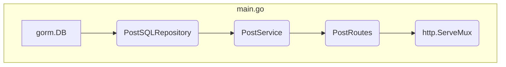

# 🌊 high-tide
Stateless SYN Flood detection using Count-Min Sketch. Tracks net connection imbalance with constant memory efficiency

Table of Contents
---
<!-- TOC -->
* [About](#about)
* [Building and Running](#building-and-running)
  * [Building the Project](#building-the-project)
  * [Install Dependencies](#install-dependencies)
  * [Running the Project](#running-the-project)
  * [Testing Count-min Sketch](#testing-count-min-sketch)
* [Directory Structure](#directory-structure)
  * [`api`](#api)
  * [`cmd`](#cmd)
  * [`countmin`](#countmin)
  * [`examples`](#examples)
  * [`internal`](#internal)
    * [`domain`](#domain)
    * [`repository`](#repository)
    * [`routes`](#routes)
    * [`server`](#server)
* [API Endpoints](#api-endpoints)
* [Dependency Injection](#dependency-injection)
  * [Dependency Injection Flow](#dependency-injection-flow)
<!-- TOC -->

---
## About

---
## Building and Running

### Building the Project

```bash
go mod init github.com/eventuallyconsistentwrites/high-tide-server
go mod tidy
```

```bash
go build -o hts-main ./cmd/api/main.go
```

### Install Dependencies

```bash
go get github.com/mattn/go-sqlite3
go mod tidy
```

### Running the Project

```bash
go run ./cmd/api/main.go

# Or in case of pre-built binary
./hts-main
```

### Testing Count-min Sketch

```bash
go test -v ./countmin
```

---

## Directory Structure

### `api`
Contains server contract information

### `cmd`
`api/main.go` contains application entry point

### `countmin`
Contains data structure logic of Count-Min Sketch

### `examples`
Contains demo go script to use `CountMinSketch` data structure

### `internal`

#### `domain`
Contains definitions for data structures that will be used to structure the incoming request bodies as well as define sqlite tables.

#### `repository`
Related to ORM system that is used to make the sqlite queries.

#### `routes`
Defines APIs

#### `server`
Contains business logic that makes use of repositories. The results are returned to the APIs that queried the server.

---

## API Endpoints

Check the [openapi specs](high-tide-server/api/openapi.json) to know more about the endpoints.
<table>
  <thead>
    <tr>
      <th>URL</th>
      <th>Method</th>
      <th>Description</th>
      <th>Request Body</th>
      <th>Responses</th>
    </tr>
  </thead>
  <tbody>
    <tr>
      <td rowspan="5"><code>/posts</code></td>
      <td rowspan="3"><code>POST</code></td>
      <td rowspan="3">Creates a new post in the system.</td>
      <td rowspan="3">A JSON object representing the post to be created.</td>
      <td><code>201 Created</code>: Post successfully created. Returns the created post object.</td>
    </tr>
    <tr>
      <td><code>400 Bad Request</code>: Invalid request body.</td>
    </tr>
    <tr>
      <td><code>500 Internal Server Error</code>: Failed to create post due to a server-side error.</td>
    </tr>
    <tr>
      <td rowspan="2"><code>GET</code></td>
      <td rowspan="2">Retrieves a list of all available posts.</td>
      <td rowspan="2"></td>
      <td><code>200 OK</code>: Returns a JSON array of all posts.</td>
    </tr>
    <tr>
      <td><code>500 Internal Server Error</code>: Failed to fetch posts due to a server-side error.</td>
    </tr>
    <tr>
      <td rowspan="8"><code>/post?id={id}</code></td>
      <td rowspan="4"><code>GET</code></td>
      <td rowspan="4">Retrieves a single post by its unique ID.</td>
      <td rowspan="4"></td>
      <td><code>200 OK</code>: Returns the post object matching the provided ID.</td>
    </tr>
    <tr>
      <td><code>400 Bad Request</code>: Missing ID parameter.</td>
    </tr>
    <tr>
      <td><code>404 Not Found</code>: Post with the given ID does not exist.</td>
    </tr>
    <tr>
      <td><code>500 Internal Server Error</code>: Failed to retrieve post due to a server-side error.</td>
    </tr>
    <tr>
      <td rowspan="4"><code>DELETE</code></td>
      <td rowspan="4">Deletes a post by its unique ID.</td>
      <td rowspan="4"></td>
      <td><code>200 OK</code>: Post successfully deleted. Returns the deleted post object.</td>
    </tr>
    <tr>
      <td><code>400 Bad Request</code>: Missing ID parameter.</td>
    </tr>
    <tr>
      <td><code>404 Not Found</code>: Post with the given ID does not exist.</td>
    </tr>
    <tr>
      <td><code>500 Internal Server Error</code>: Failed to delete post due to a server-side error.</td>
    </tr>
  </tbody>
</table>

---

## Dependency Injection

The High-Tide server utilizes a dependency injection pattern to manage its components, promoting modularity, testability, and maintainability. The `main.go` file orchestrates the creation and wiring of these dependencies.

### Dependency Injection Flow



Here's a breakdown of the dependency injection flow:

1.  **Database Connection:**
    -   A connection to the SQLite database (`high_tide.db`) is established using `gorm.Open(sqlite.Open("high_tide.db"), &gorm.Config{})`.
    -   The database schema is automatically migrated to match the `domain.Post` struct using `db.AutoMigrate(&domain.Post{})`.

2.  **Repository Layer:**
    -   An instance of `PostSQLRepository` is created using `repository.NewPostSQLRepository(db)`.
    -   The `db` (GORM database client) is injected into the `PostSQLRepository`, allowing the repository to interact with the database.

3.  **Service Layer:**
    -   An instance of `PostService` is created using `service.NewPostService(postRepo)`.
    -   The `postRepo` (PostSQLRepository) is injected into the `PostService`. The service layer encapsulates business logic and uses the repository to perform data operations.

4.  **Routes/Handler Layer:**
    -   An instance of `PostRoutes` (which acts as the HTTP handler for post-related requests) is created using `routes.NewPostRoutes(postSvc)`.
    -   The `postSvc` (PostService) is injected into the `PostRoutes`. This allows the handlers to call service methods to execute business logic.

5.  **HTTP Server Setup:**
    -   An `http.ServeMux` is created to act as the router.
    -   The `RegisterRoutes` method of `postHandler` is called, passing the `mux`. This registers all the defined HTTP endpoints (`/posts`, `/post`) with their corresponding handler functions (`CreatePost`, `GetAllPosts`, `GetPost`, `DeletePost`).

This structured approach ensures that each layer of the application is responsible for a specific concern and can be easily swapped or tested independently.

---
